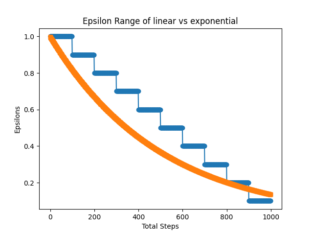
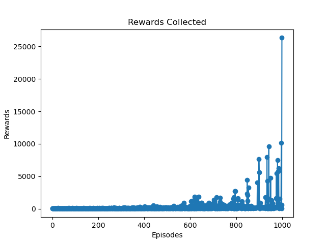
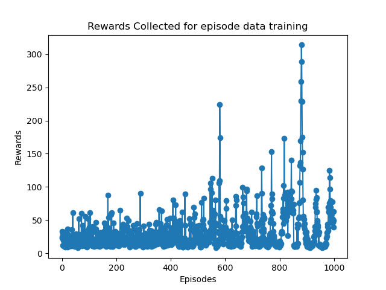

# Deep-Reinforcement-Learning
All my Deep Reinforcement Learning codes are here

Project - 1
  # To implement a basic DQN for training on a basic Cart Pole Environment.

  The file dqntest1.py is related to the project with all the required code. Please make sure you have OPEN AI GYM and PYTORCH [GPU] packages installed before running the code.

  The epsilon_test.py is a comparission between how a linear decay of epsilon would differ from a exponential decay. Below is the graph pointing the same.
 
  
  
# The Comparission between a step by step model training and episode by episode model training.

The below image represents the step by step training where the model is trained for every step in the cart pole environment. 

The below image represents the episode by episode training where the model is trained for at the end of every episode with all the required data from the episode. 

I believe that in episode by episode training method the model is trying to become more and more perfect and is being overfitted for the data given. Hence we see a continous rise and fall of reward collected. But, this measure on Cart Pole is not an accurate measure. 

# Importance of having a Target Network in Deep Reinforcement Learning

