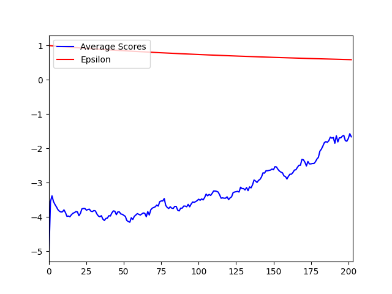

# Challenge of a Non-Stationary Target

In Deep Reinforcement Learning step-by-step training takes place for the agent to learn the task. During this step-by-step training the model is trained at each step
with random batch of experiences pulled from the memory we store for the training.

During the training in order to update the weigths of the model loss is calculated between the predicted Q-values of the states with respect to the action and target values calculated
based on the Equation
```markdown
target = reward + (discount_factor * max(model(newstates)) * (1 - done)) 
```
Since, for every step the model is being trained for the same state the Q-values will vary everytime. This changing Q-values will impact the back propagation process making it hard for the model to learn.

As a solution to this issue of Non-Stationary Target the target equation has been updated to

```markdown
target = reward + (discount_factor * max(target_model(newstates)) * (1 - done)) 
```
Where, the target_model is a copy of the original model. This target model should be updated periodically with the original model weights so that the new trained model can become the new target for improving.

# No Target Training vs Target Training
In order to validate the impact of Non-Stationart Target I have implemented two versions of Dueling DQN on 'Breakout NOFrameSkip v4'  and . The difference in their scores over a period of 2000 episodes can be observed here




